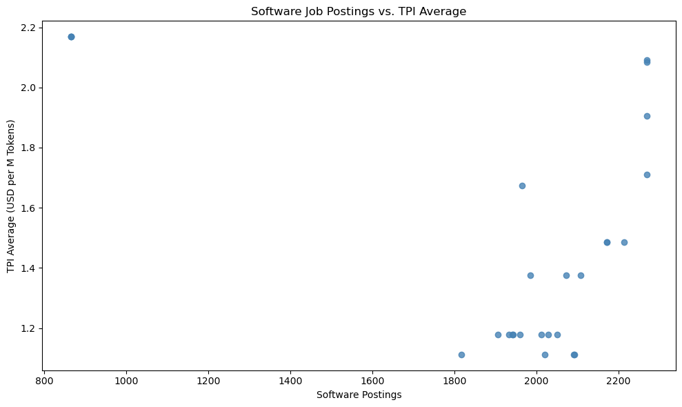
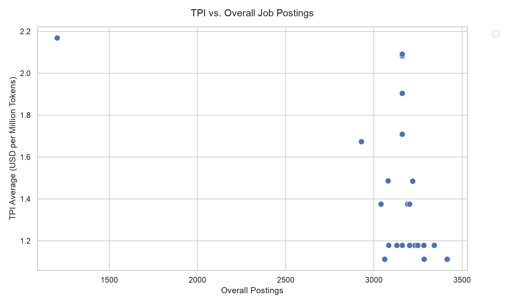
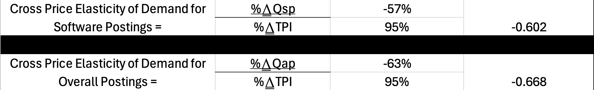
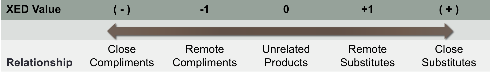
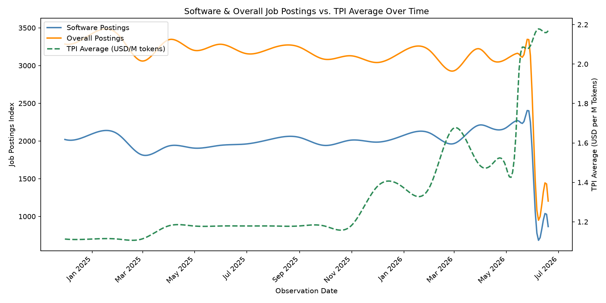

## EDA

Here is a description of the graph below

Cross Price Elasticity of Demand (XED) is a measure used in economics to show the responsiveness, or elasticity, of the quantity demanded of a good or service to a change in the price of another good. It is calculated as the percentage change in quantity demanded for good x divided by the percentage change in price of good y

- XED = (%ΔQdx) / (%ΔPy)

Both Software and All Postings have a negative XED, which implies that they are complimentary, rather than substitute goods as is expected.

This means that as the price of AI services (as measured by TPI) increases, the demand for both software and overall job postings decreases.

**Both are relatively inelastic, implying that they are still relatively remote compliments.**

## Data Selection

Here is where you will talk about what data sources you selected, and why. How do they pertain to your research questions? Was this the best data available?

## Data Acquisition

Here is where you will talk about HOW you acquired your data. Detail any APIs used, any websites accessed, or any directories downloaded

## Data Cleaning

Here is where you will discuss how you cleaned, engineered, or otherwise adjusted any of the data from the Acquisition stage.