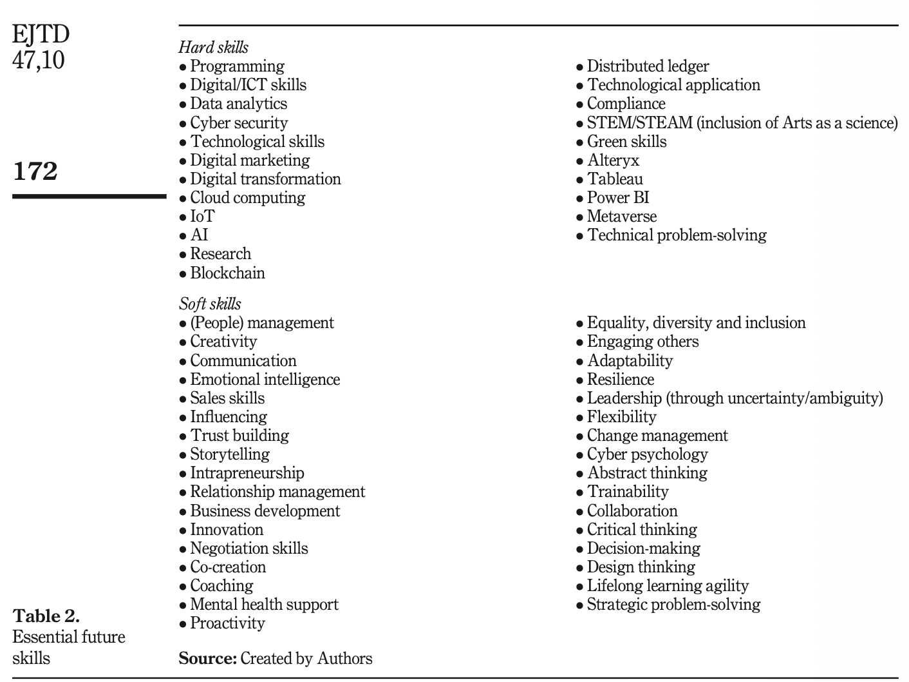

## Introduction & Motivation

**Are we cooked?**

The rise of Artificial Intelligence (AI) technologies, including Machine Learning, Generative Adversarial Networks, and Generative AI are rapidly transforming the job market. While these advancements offer new opportunities, they also pose significant challenges for high school students preparing to enter the workforce. As a result, both students and parents are freaking out:

- A 2025 Survey BY JA/Citizens found [57% of high school students](https://www.jacitizens.org/2025-survey-shifting-attitudes-toward-ai) believe AI has negatively impacted their career outlook.
- [Nearly one in five American workers](https://www.economist.com/finance-and-economics/2026/05/14/the-jobs-apocalypse-a-very-short-history?utm_campaign=shared_article) recently told another pollster that AI or automation is “very” or “somewhat” likely to replace them.
- [53 percent of parents](https://www.educationnext.org/students-are-anxious-about-future-with-a-i-parents-are-too-technology-college/) are somewhat or very concerned that AI will narrow their children’s job prospects.

**Short answer...no, we are not cooked.** But we are in a period of rapid change, and the future of work is uncertain. This projects aims to explore the skills and knowledge that you will need to thrive in a world where AI is increasingly prevalent. By analyzing current trends, educational resources, and industry demands, we will provide actionable insights to help you prepare for the evolving job market.

------------------------------------------------------------------------

## Official Research Questions

- **Primary Research Question (RQ1):** *How has the adoption of AI affected the types of skills employers request in entry level job postings.*
- **Potential Secondary Research Question (RQ2):** *To what extent do these entry level skill requirements vary across different industries?*

------------------------------------------------------------------------

## Initial Literature Review

### Prior Work 1:

*Canaries in the Coal Mine: The Impact of Artificial Intelligence on the Labor Market*

**Authors:** Erik Brynjolfsson, Bharat Chandar, Ruyu Chen

**Core Finding:** *The paper documents six facts characterizing labor market shifts following the widespread adoption of generative AI:*

1.  Since the widespread adoption of generative AI, early-career workers (ages 22-25) in the most AI-exposed occupations have experienced a 16 percent relative decline in employment even after controlling for firm-level shocks
2.  overall employment continues to grow robustly, but employment growth for young workers has been stagnant since late 2022
3.  Entry-level employment has declined in applications of AI that **automate** work, but not those that most **augment** it
4.  Employment declines for young, AI-exposed workers remain after conditioning on firm-time effects such as interest rate changes
5.  The labor market adjustments are visible in employment more than in compensation.
6.  The results are not driven solely by computer occupationsor byoccupationssusceptibleto remoteworkand outsourcing.

**How it informs my project:**

- *Facts 1 and 3 are particularly relevant to our project, as they suggest that the adoption of AI has had a significant impact on the employment prospects of young workers in certain occupations. This aligns with our primary research question, which seeks to understand how AI adoption has affected the types of skills employers request in entry-level job postings.*

- *This will be tested using the Price Elasticity of Demand (PED) metric, which measures the responsiveness of the quantity demanded of a good or service to a change in its price. In this case, we can use PED to measure the responsiveness of entry-level job postings to changes in AI adoption making a distinction between ALL entry jobs and software engineering related positions*.

### Prior Work 2:

*Automation, artificial intelligence and future skills needs: an Irish perspective*

**Authors:** *Raimunda Bukartaite and Daire Hooper*

**Core Finding:**

The accelerated pace of technological change is leading to evolving skill demands across all workforce sectors. While STEM skills are often prioritized, soft skills like collaboration and critical thinking are also crucial for bridging the skill gap and effectively adopting advanced technologies.\
{width="604"}

**How it informs our project:**

- Using NLP (natural Language Processing), I will look for patterns in the key skills mentioned in "entry level" job postings on Google Jobs in the US over the last 5 years.

------------------------------------------------------------------------

## Data Source Orientation

Briefly document the raw data you intend to use to answer your research questions.

| Data Asset Name | Source Agency / URL | Format (.csv, API, SQL) | Row/Column Count (Est.) |
|-------------|-----------------------------------------------------|----------|----------|
| Overall Job Postings | FRED (<https://fred.stlouisfed.org/series/IHLIDXUS?utm_source=chatgpt.com>) | *.csv* | *\~1828 x 12* |
| Software Job postings | FRED (<https://fred.stlouisfed.org/series/IHLIDXUSTPSOFTDEVE?utm_source=chatgpt.com>) | .csv | *\~1828 x 12* |
| tpi_average_nov2024_jun2026_1 | Token Price Index (<https://tokenpriceindex.com/>) | .csv | \~ 27 x 5 |